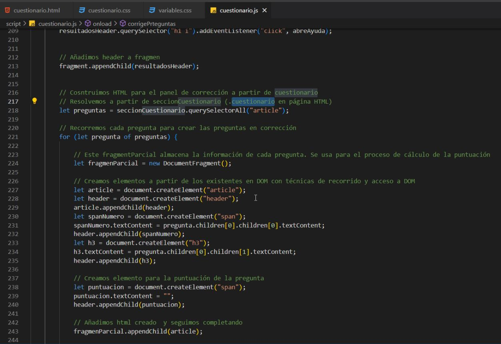

# Cuestionario

## Cuestionario HTML


es esto?

## Index HTML

## Variables CSS

## Index CSS


## Cuestionario CSS


animaciones


box imagenes


## CuestionarioJS

Encima de la siguiente
``` js
let cuestionario = []
```


corrige preguntas





panel ayuda


## ImagenesJS

## CuestionarioJS 2


